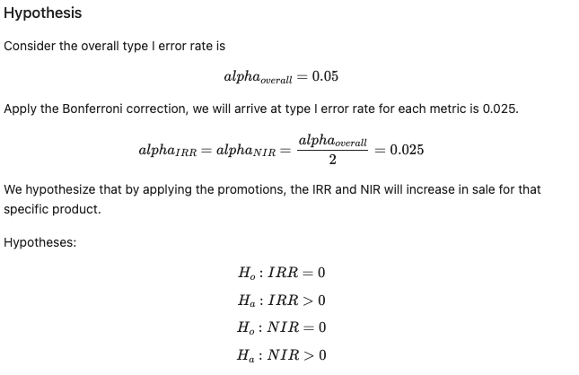
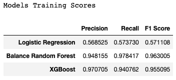
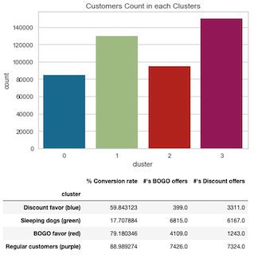

# Promotion-Targeting-and-Users-Segmentation
- [Project Motivation](#Motivation)
- [Project Workflow](#Workflow) 
**A. Predictive Classifier**
- [A1. Hypothesis Testing](#Hypothesis)
- [A2. Modelling](#Model) 
**B. Customer Segmentation**
- [B1. EDA](#EDA)
- [B2. Feature Engineering](#Feature-Engineering)
- [B3. Segmentation Model](#Clustering) 
- [Discussion](#Discussion)
- [Licensing, Authors, Acknowledgements](#License)

# Project Motivation 

**Background:** To drive customers' purchases and increase profit, Starbucks sends out promotional offers on mobile apps to customers during the marketing campaign. The offers are presented in 3 ways:
- Discount: The user gains a reward equal to a fraction of the amount spent
- BOGO (buy one get one free): The user needs to spend a certain amount to get a reward equal to that threshold amount
- Informational: an advertisement for a drink or product

Not all users receive the same offer, and not all purchases are made using offers. The customers' responses to offers are categorized as:
- received: received the offers from different channels (email, mobile, social)
- viewed: viewed the offers
- completed: made a purchase with the offers

**The goal** of this project is:
- to build a model that predicts which customers would receive offers to, specifically, maximize the two KPIs metrics: Incremental Response Rate (IRR) and Net Incremental Revenue (NIR)
- to define customer segmentations based on their transactions, demographics, and responses to offers

**The dataset** represents 1-month simulated data that mimics customer behavior. The set contains 4 files, 3 of which are used for customer segmentation and 1 is for building the predictive model.

# Project Workflow 
 
Figure 1. Project workflow to segment the customers that are receiving offers and to build a predictive model

# A. Predictive Classifier (Control_A and Treated_A)
Determine if promotional offers help increase the business KPIs: IRR (incremental response rate) and NIR (net incremental rate).
- The dataset: a control group (no offers) and a treatment group (received offers) 

## A1. Hypothesis Testing 
A hypothesis test to evaluate whether promotions have a positive impact on increasing the IRR and NIR. (See folder KPIs for more details)

 

**Results**
- p-value IRR = 0.0 -> Reject Ho -> Increase purchase rate
- p-value NIR = 0.99999 -> Do not reject Ho -> NIR = 0

The promotion increases the IRR (response rate) but not the NIR, which indicates Starbucks **needs to re-asset the target groups**. We will visit this in the Customer Segmentation part of the project.  

## A2. Modeling 
This dataset is highly imbalanced. The number of customers not making purchases is much more than those who do (80:20), regardless of whether they receive promotional offers or not. For this reason, standard ML algorithms applying to the given data set will have a tendency to assign No-Purchase to all customers rather than trying to classify them.

- The SMOTE method was applied to balance the train data set by upsampling the label '1', from 80:20 to 50:50 
- Compared the performance of 3 models: Logistic regression, Balanced random forest classifier, and XGBoost.
  
 
Figure 2. Compare the performance of 3 classification models on the train set.

Balanced random forest and XGBoost performed well on the train set. However, when applying the models on the highly imbalanced dataset **XGBoost** performed best and resulted in the highest IRR value and a positive NIR value: (0.0306, $122.25)
| Model  | IRR | NIR |
| -------- | --- | --- |
| Current  | 0.0095 | -2334.6|
| XGBoost  | 0.0306 | 122.25|
| Balanced random forest | 0.0041 | -119.00|

 
Figure 3. The lift chart analyzed from the test set with the XGBoost classifier 

**Result**
Target the top 10 - 20% of the population will potentially result in a 1.29 - 1.35X lift in response rate 

# B. Customers Segmentation (Treated_B)
From the results of building a classifier (part A), we see that giving out the promotion is not yet profitable. I'm going to analyze the current customer segmentation to identify whether Starbucks is targeting the right audience. 
- Dataset: treated group (all customers received promotional offers)

## B1. EDA 
First, we checked the dataset's quality, including examining the missing data, duplicated entries, and feature distribution.  
The features include
- customers demographics: sex (male, female, other), age, income, the amount spent
- type of offers (BOGO, discount, informational)
- Customers' responses to offers (offer received, viewed, completed)

**Customer Demographics**
 
Figure 4. Features Distributions: gender (F: female, M: male, O: other), age, and income. The median income range is $49,000 — $79,000, and the average transaction is $119.66.

 
Figure 5. Income, age, and transactions made regarding gender

*Key findings*:
- Most customers identified as male
- The Average age of customers is: 54.0 years old
- The average income of customers is: $65206.98

**Offers distribution**
 
Figure 6. Customer responses distribution (received, viewed, completed) and gender distribution regarding each type of offer.

*Key findings*:
- Dominant offers are BOGO (42.9%) and Discount (41.9%)
- All 3 types of offers are equally distributed to all genders
- Purchase generated slightly more from Discount than BOGO

## B2. Feature Engineering 

Compute **Recency, Frequency, Monetary Value (RFM)**
- Recency: number of days after the test starts
- Frequency: how many times the customer makes purchases
- Monetary value: the total amount a customer spent

Compute: customer's **responses rates** (viewed_rate, completed_rate) for each type of offer and total conversion rate
- total conversion rate = completed / received
- viewed rate (vr) = viewed / received
- completed rate (cr) = completed / received
  
## B3. Segmentation Model 
I utilized the PCA technique to reduce the complexity of the dataset. K-means clustering analysis (elbows and silhouette methods) was used to identify four (4) groups of customers who were responsive to offers and likely to make a purchase (convert).

Currently, the offers are *significantly targeted the bottom segment*, who don’t interact with the offers. This group is the second largest group receiving offers for this test. Based on the segmentation analysis, we can better target the right groups that convert well to boost profit.
We can continue to send out offers that are discount and BOGO since they drive customers' buying decisions. Customers are receptive to BOGO more than discounts. 

 
Figure 7. Clusters distributions. Cluster 0: Discount favors, Cluster 1: Sleeping dogs, Cluster 2: BOGO favors, and Cluster 3: Regular customers.

* **Discount favors (blue)**: receive mainly discounts, minimal BOGO
* **Sleeping dogs (green)**: frequently receive offers but never open nor complete, and the audience seems to be turned off by offers
* **BOGO favors (red)**: convert very well using BOGO
* **Regular customers (purple)**: convert very well (88.99%) by using both discount and BOGO which were received regularly

 
Figure 8. Segmentation analysis utilizing K-means, where k = 4.

## Conclusion 
After segmenting the current customers who received promotional offers and calculating the business KPIs, 2 conclusions are being drawn:
1. Promotional offers indeed increase the response rate, but not yet the net profit rate. Although customers responded well to the promotion, this might cause revenue loss since the promotions are highly utilized.
2. Customers are more likely to purchase with BOGO than discounts (by 20%), target the top 10 - 20% of customers
3. Stop distributing offers to the bottom segment 

## Licensing, Authors, Acknowledgements 
* Starbucks for providing the datasets and project goal
* Udacity
* The main findings and results of this project can be found in this [post](https://medium.com/@nguyenpham111/starbucks-promotional-offers-how-they-influence-customers-buying-behaviors-57e62ca2c0f5)
* Author: [Nguyen Pham](https://github.com/Az-otrope)
