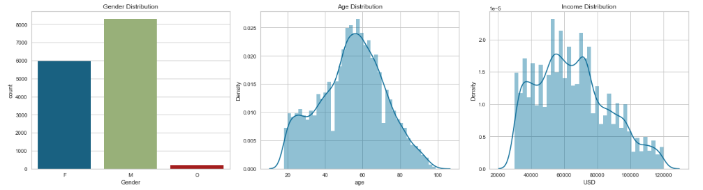
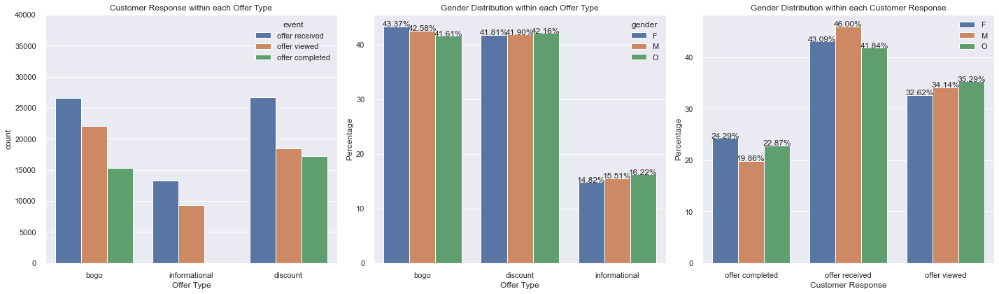

# Users-Segmentation-and-Promotion-Targeting
- [Motivation](#Project-Motivation)
- [Installation](#Installation)
- [Feature Engineering](#Feature-Engineering)
- [EDA](#EDA)
- [Results](#Results)
- [Discussion](#Discussion)
- [Licensing, Authors, Acknowledgements](#License)

## Project Motivation 

**Background:** This data set contains 1-month simulated data that mimics customer behavior on the Starbucks rewards mobile app. The dataset entails customers’ input information, spending habits, and transactions made on the app.
Starbucks sends out an offer to users of the mobile app every few days. Some users may receive offers frequently, some may not for a while. The offers are presented in 3 ways:
Discount: The user gains a reward equal to a fraction of the amount spent
BOGO (buy one get one free): The user needs to spend a certain amount to get a reward equal to that threshold amount
Informational: an advertisement for a drink or product
Not all users receive the same offer, and not all purchases are made using offers. That makes data wrangling a big challenge for this dataset.

**The goal** of this project is to combine transaction, demographic, and offer data to determine which demographic groups respond best to which offer type.

## Installation 
The following packages and versions are used in this Jupyter Notebook. Any newer versions should work. 
| Package  | Version |
| ------------- | ------------- |
| Python  | 3.7.6  |
| Pandas  | 1.3.5  |
| Numpy   | 1.21.6 |
| Matplotlib | 3.5.2|
| plotly | 4.8.2  |

## Feature Engineering 
Compute **Recency, Frequency, Monetary Value (RFM)**
- Recency: number of days after the test starts
- Frequency: how many times the customer makes purchases
- Monetary value: the total amount a customer spent

For each type of offer, the responses (received, viewed, and completed) are counted and calculated into rates (view_rate, complete_rate)
- bogo_vr, bogo_cr
- discount_vr, discount_cr
- info_vr, info_cr
  
## EDA 
First, we take a look at the **feature distribution**. The features include sex (male, female, other), age, income, the amount spent, type of offers (BOGO, discount, informational), and customers' responses to offers (offer received, viewed, completed).

 
Figure 1. Features Distributions: gender, age, income, and the amount spent on transactions. The median income range is $49,000 — $79,000 and the average transaction is made at $119.66.

 
Figure 2. Income, age, and transactions made with respect to gender

*Key findings*:
- Most customers identified as male
- For transactions more than 300 USD or so, there is an observed linear between income and the amount spent. This behavior is the same for both genders Female and Male
- Other gender spends less than Female and Male

**Offers distribution**

 
Figure 3. Distribution of Offer Types (L) and Customers Response to Offers (R)

 
Figure 4. Customer responses to each type of offer.

*Key findings*:
- Dominant offers are BOGO (42.9%) and Discount (41.9%)
- Male receives more offers compared to female and other.
- Male adults are more responsive to offers.
- Purchase usually comes from Discount then BOGO

## Results 
I utilized the PCA technique to reduce the complexity of the dataset. K-means clustering analysis was used to identify four (4) groups of customers who were responsive to offers and likely to make a purchase (convert).

 
Figure 5. Segmentation analysis utilizing K-means, where k = 4.

**Receive offers regularly**  
- convert very well
- is also currently the target audience to receive many offers compared to other genders in all age groups
- males and female-identified

**Receive BOGOs**  
- convert very well
- mainly receive BOGO offers and utilize them
- males and female-identified

**Don't receive BOGOs at all, but mainly discounts**  
- rarely receive any BOGOs
- make frequent purchases with or without offers

**Receive many offers but don't convert**  
- frequently receive offers but never open nor complete
- mainly male

Currently, the offers are significantly spent on one wrong audience, who don’t interact with the offers. This group is the second large in size of this test. Based on the segmentation analysis, we can now better target the right groups that convert well to boost profit.
We can continue to send out offers that are discount and BOGO since they drive customers' buying decisions. The reward value also excites customers. 
The source of offers that highly correlates with conversion rate are social and website. Here is the cue that we should focus on optimizing the presentation of offers on Starbucks's social platform and homepage.

 
Figure 6. Clusters distributions. Cluster 0: don’t receive BOGO, Cluster 1: receives regular offers but never converts, Cluster 2: mainly receives BOGO and converts very well, and Cluster 3: receives offers regularly and converts well.

## Discussion 
More sophisticated strategies could be employed to achieve a higher conversion rate among Starbucks customers. Uplift modeling can be used to identify the right customer group for a specific promotion. The uplift model method of "two classifiers" can be used. The process will consist of two steps:
1. Conduct a randomized A/B test, in which the treatment group of customers receives and offers and the control group does not. Train classifiers to predict the likelihood (probability) of conversion for both groups. Add two classifiers into one using a special library (upliftML, casualML). Use a combined classifier on the entire customer base to identify customers with high conversion probability.
2. Conduct a second A/B test, in which the treatment group is customers with a high conversion probability receive promo offers and the control group consisting of random customers also receive promo offers. Calculate lift as the difference in total conversion or total amount spent.

This method allows for more quantitative customer segmentation and promo offerings, rather than qualitative, human-decision-based strategies.

## Licensing, Authors, Acknowledgements 
* Starbucks for providing the datasets and project goal
* [Udacity](https://www.udacity.com/) for instructions
* The main findings and results of this project can be found in this [post](https://medium.com/@nguyenpham111/starbucks-promotional-offers-how-they-influence-customers-buying-behaviors-57e62ca2c0f5)
* Author: [Nguyen Pham](https://github.com/Az-otrope)
